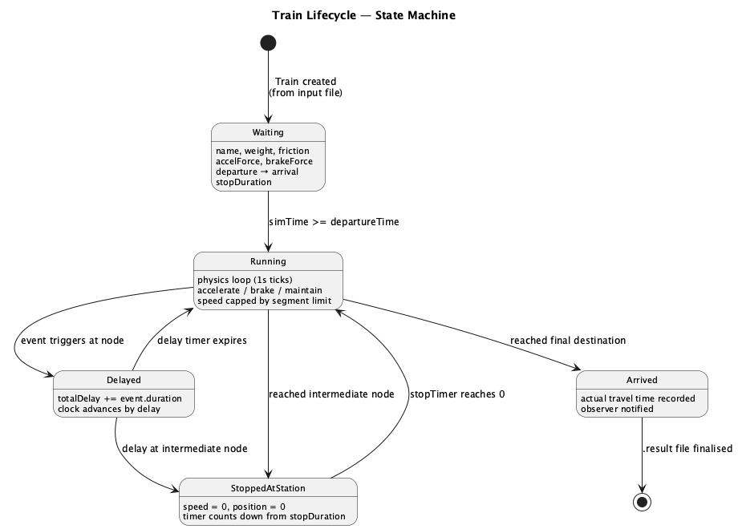
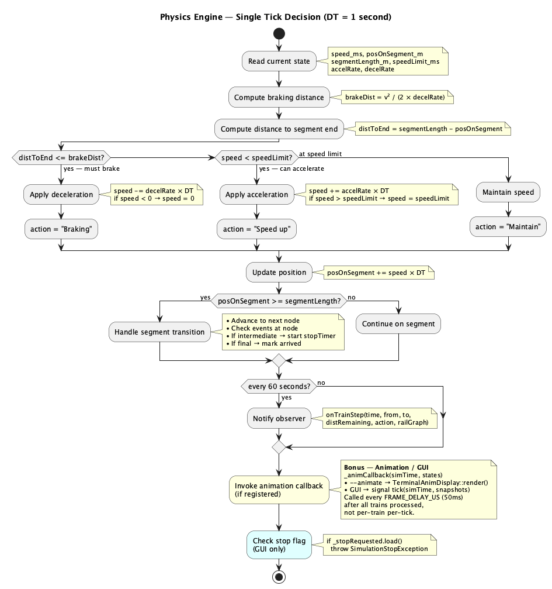
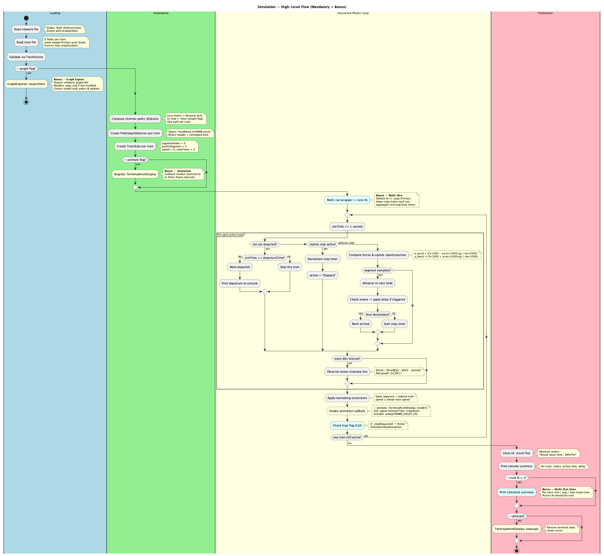

# UML Diagrams

> Back to [TECHNICAL.md](TECHNICAL.md) · [README](../README.md)

All diagrams are PlantUML sources in `docs/diagrams/`. Pre-rendered **PNG** and **SVG** versions are committed alongside.

- **PNG** — bitmap, good for GitHub README previews.
- **SVG** — vector, scalable without loss, ideal for zooming into the class diagram.

---

## Class Diagram

Full project structure with all classes, relationships, and bonus packages. For UML arrow semantics (composition, association, dependency, realisation, inheritance), see [DESIGN_PATTERNS.md · Class Relationships](DESIGN_PATTERNS.md#class-relationships).


SVG: [class_diagram.svg](diagrams/class_diagram.svg) · Source: [class_diagram.puml](diagrams/class_diagram.puml)

---

## State Machine — Train Lifecycle

Shows how a train transitions through states: Waiting → Running → Stopped/Delayed → Arrived. Includes the bonus **Aborted** state (GUI stop button).



SVG: [state_train_lifecycle.svg](diagrams/state_train_lifecycle.svg) · Source: [state_train_lifecycle.puml](diagrams/state_train_lifecycle.puml)

---

## Activity — Physics Engine (Single Tick)

The decision flowchart for each 1-second physics tick: brake, accelerate, or maintain. Includes bonus animation callback and stop flag check.



SVG: [activity_physics_tick.svg](diagrams/activity_physics_tick.svg) · Source: [activity_physics_tick.puml](diagrams/activity_physics_tick.puml)

---

## Activity — Simulation Overview

End-to-end flow: loading → initialisation → concurrent physics loop → finalisation. Includes bonus branches for `--graph`, `--animate`, `--runs N`, and GUI stop.



SVG: [activity_simulation_overview.svg](diagrams/activity_simulation_overview.svg) · Source: [activity_simulation_overview.puml](diagrams/activity_simulation_overview.puml)

---

## Sequence — Full Simulation Run

Complete lifecycle: loading → path computation → train simulation → results. Shows CLI and GUI paths, animation callback, graph export, multi-run wrapper.


SVG: [sequence_simulation_run.svg](diagrams/sequence_simulation_run.svg) · Source: [sequence_simulation_run.puml](diagrams/sequence_simulation_run.puml)

---

## Sequence — Input Parsing

Details how the two input files are parsed into the domain model, including duration/time parsing, factory validation, and the GUI's deferred parsing path.


SVG: [sequence_input_parsing.svg](diagrams/sequence_input_parsing.svg) · Source: [sequence_input_parsing.puml](diagrams/sequence_input_parsing.puml)

---

## Sequence — Dijkstra Pathfinding

The shortest-path algorithm: validation, priority queue loop, and path reconstruction. Shows both Distance and Time weight modes.


SVG: [sequence_pathfinding.svg](diagrams/sequence_pathfinding.svg) · Source: [sequence_pathfinding.puml](diagrams/sequence_pathfinding.puml)

---

## Regenerating Diagrams

To regenerate PNGs and SVGs from the `.puml` sources (requires [PlantUML](https://plantuml.com/)):

```bash
cd docs/diagrams
PLANTUML_LIMIT_SIZE=16384 plantuml -tpng *.puml
PLANTUML_LIMIT_SIZE=16384 plantuml -tsvg *.puml
```

> **Note:** `PLANTUML_LIMIT_SIZE=16384` raises the default 4096 px pixel cap so the class diagram renders at full resolution.
