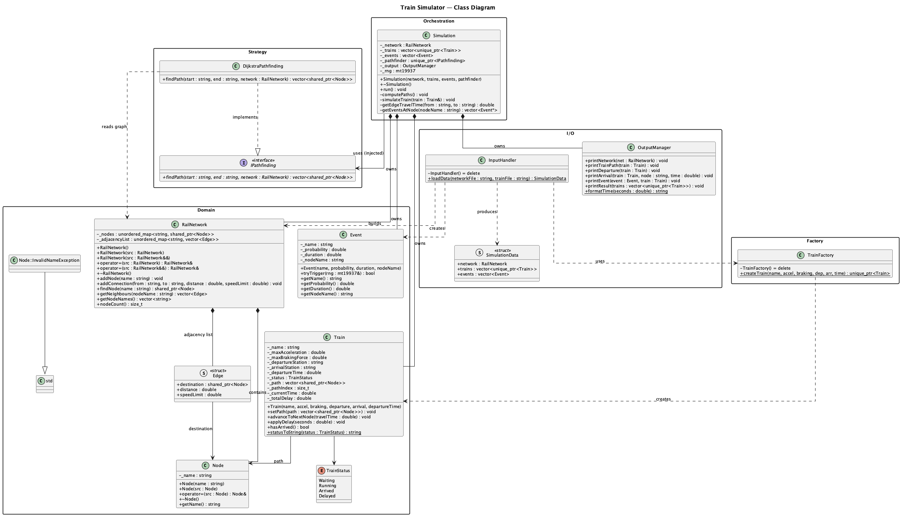
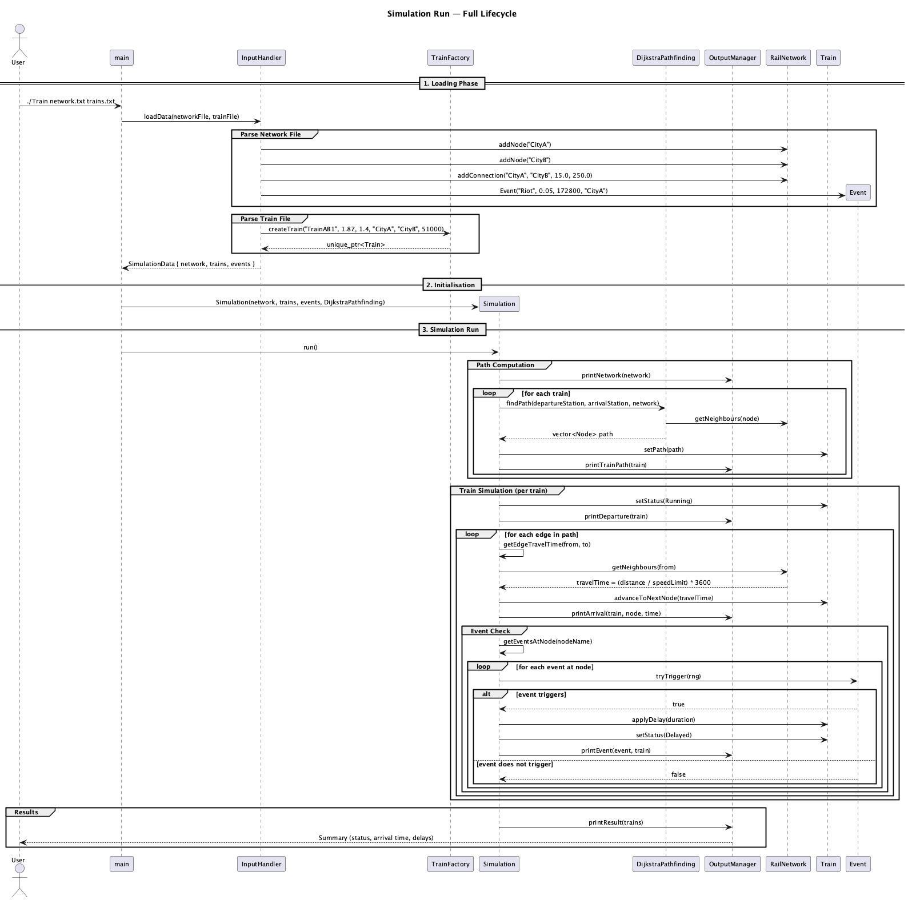
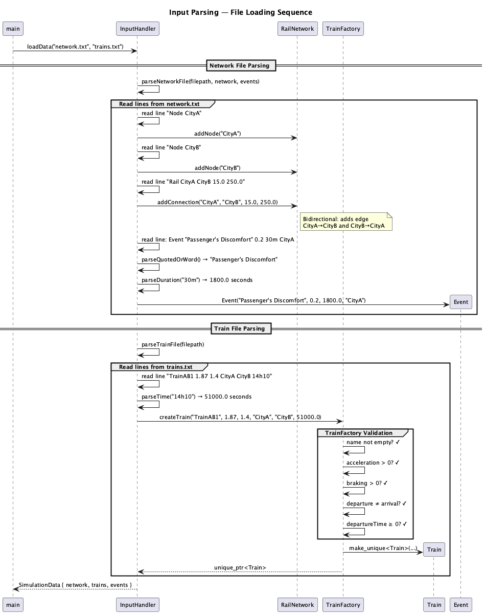
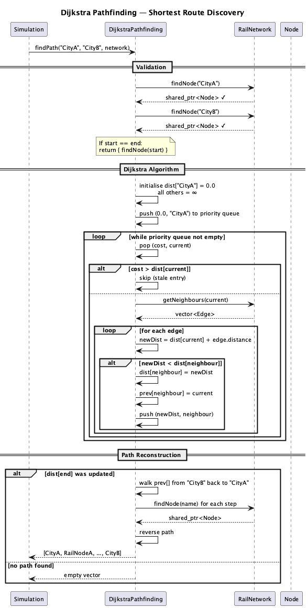

# Technical Documentation

## Table of Contents

1. [Business Logic](#business-logic)
2. [Class Diagram](#class-diagram)
3. [Sequence Diagrams](#sequence-diagrams)
4. [Architecture Overview](#architecture-overview)
5. [Design Patterns](#design-patterns)
6. [Build System](#build-system)
7. [Testing](#testing)
8. [CI Pipeline](#ci-pipeline)

---

## Business Logic

### What the Simulator Models

The system models a **rail network** where trains travel between stations along tracks, finding the fastest routes and encountering random disruptions along the way. It answers: *"Given a network and a schedule, when does each train arrive, and how much delay do disruptions cause?"*

### Core Business Rules

#### 1. Network Definition

A rail network consists of **stations** (nodes) connected by **tracks** (edges). Each track has:
- A **distance** in kilometres (must be positive)
- A **speed limit** in km/h (must be positive)

Connections are **bidirectional** — if CityA connects to CityB, CityB also connects to CityA. Self-loops (a station connected to itself) are forbidden. Duplicate connections between the same pair of stations are rejected.

#### 2. Train Scheduling

Each train has:
- A **departure station** and an **arrival station** (must be different)
- A **departure time** (e.g., 14h10 = 2:10 PM)
- Physical properties: **acceleration** and **braking force** (both must be positive)

Trains are simulated in **departure-time order** — the train scheduled earliest runs first.

#### 3. Route Selection

Before simulation begins, each train is assigned the **shortest route** through the network using Dijkstra's algorithm. The cost metric is **distance** (not time). If no route exists, the train is skipped with a warning.

A train travelling from CityA to CityB might take: `CityA → RailNodeA → RailNodeD → CityB` if that path has the shortest total distance.

#### 4. Travel Time Calculation

For each segment of a train's route, travel time is:

$$t = \frac{d}{v} \times 3600$$

Where $d$ is the edge distance (km), $v$ is the speed limit (km/h), and $t$ is the result in seconds. The train's clock advances by this amount at each hop.

#### 5. Random Events (Disruptions)

Events are bound to specific stations and have:
- A **probability** (0.0 to 1.0) of triggering each time a train arrives at that station
- A **duration** (the delay in seconds if triggered)

When a train arrives at a station, every event associated with that station rolls against its probability. If triggered, the train's clock advances by the event's duration, and the delay is accumulated.

Examples:
- `Event Riot 0.05 48h CityA` — 5% chance of a 48-hour delay at CityA
- `Event "Passenger's Discomfort" 0.2 30m CityB` — 20% chance of 30-minute delay at CityB

#### 6. Train State Machine

Each train progresses through states:

| State | Meaning |
|---|---|
| **Waiting** | Created, not yet departed |
| **Running** | Departed, travelling along route |
| **Delayed** | An event added delay to this train |
| **Arrived** | Reached the arrival station |

#### 7. Output & Results

The simulator produces:
1. **Network map** — all stations and their connections
2. **Route assignments** — the shortest path computed for each train
3. **Simulation log** — timestamped departures, arrivals at each intermediate station, and any events triggered
4. **Final report** — per-train summary: status, arrival time, total delay

---

## Class Diagram



Source: [diagrams/class_diagram.puml](diagrams/class_diagram.puml)

---

## Sequence Diagrams

### Full Simulation Run

Shows the complete lifecycle: loading → path computation → train simulation → results.



Source: [diagrams/sequence_simulation_run.puml](diagrams/sequence_simulation_run.puml)

### Input Parsing

Details how the two input files are parsed into the domain model, including duration/time parsing and factory validation.



Source: [diagrams/sequence_input_parsing.puml](diagrams/sequence_input_parsing.puml)

### Dijkstra Pathfinding

The shortest-path algorithm: validation, priority queue loop, and path reconstruction.



Source: [diagrams/sequence_pathfinding.puml](diagrams/sequence_pathfinding.puml)

---

## Architecture Overview

The simulator follows a layered architecture with clear separation of concerns:

```
main.cpp
  └─ InputHandler        (parse files → SimulationData)
  └─ Simulation          (orchestrator)
       ├─ RailNetwork    (graph: nodes + edges)
       ├─ Train[]        (state machines)
       ├─ Event[]        (probabilistic disruptions)
       ├─ IPathfinding   (strategy interface → DijkstraPathfinding)
       └─ OutputManager  (formatted output)
```

## Folder Structure

Each class lives in its own folder with separated `.hpp` / `.cpp` files:

```
src/
├── main.cpp                              Entry point
├── Node/                                 Station in the network
├── Edge/                                 Connection between nodes (header-only struct)
├── RailNetwork/                          Graph: nodes + adjacency list
├── Train/                                Train state and path tracking
├── Event/                                Probabilistic disruption
├── TrainFactory/                         Factory for validated Train creation
├── IPathfinding/                         Strategy interface (header-only)
├── DijkstraPathfinding/                  Shortest-path algorithm
├── InputHandler/                         File parser → SimulationData
├── OutputManager/                        Formatted console output
└── Simulation/                           Orchestrator: paths, simulation loop, events
tests/
├── TestFramework.hpp                     Custom assertion macros + test runner
├── NodeTest.cpp                          5 tests
├── RailNetworkTest.cpp                   14 tests
├── TrainTest.cpp                         11 tests
├── EventTest.cpp                         10 tests
├── DijkstraTest.cpp                      7 tests
├── InputHandlerTest.cpp                  8 tests
├── TrainFactoryTest.cpp                  8 tests
├── OutputManagerTest.cpp                 5 tests
└── IntegrationTest.cpp                   5 tests  (end-to-end)
```

## Design Patterns

### Strategy — Pathfinding

`IPathfinding` defines the interface; `DijkstraPathfinding` is the concrete strategy. The algorithm is injected into `Simulation` at construction, making it trivial to swap (e.g., A\*, BFS):

```cpp
class IPathfinding {
public:
    virtual ~IPathfinding() = default;
    virtual std::vector<std::shared_ptr<Node>> findPath(
        const std::string &start, const std::string &end,
        const RailNetwork &network) const = 0;
};
```

### Factory — Train Creation

`TrainFactory::createTrain()` validates all parameters before constructing a `Train`. Invalid input (empty name, zero acceleration, negative departure, etc.) throws `std::invalid_argument`.

### Dependency Injection

`Simulation` receives all its dependencies through the constructor — `RailNetwork`, `Train`s, `Event`s, and `IPathfinding` — enabling unit-testable design without globals or singletons.

### Orthodox Canonical Form

All value-type classes (`Node`, `Train`, `Event`, `RailNetwork`, `OutputManager`, `DijkstraPathfinding`) implement the canonical four: default/parameterised constructor, copy constructor, copy assignment operator, destructor. `RailNetwork` additionally provides move constructor and move assignment.

## Class Reference

### Edge (struct)

Header-only POD in `src/Edge/Edge.hpp`:

| Member | Type | Description |
|---|---|---|
| `destination` | `shared_ptr<Node>` | Target node |
| `distance` | `double` | Kilometres |
| `speedLimit` | `double` | km/h |

### Node

A station in the rail network. Throws `InvalidNameException` on empty name.

### RailNetwork

Undirected graph stored as `unordered_map<string, shared_ptr<Node>>` + `unordered_map<string, vector<Edge>>`. Validates: no self-loops, positive distance/speed, no duplicates. Custom exceptions: `NodeNotFoundException`, `DuplicateNodeException`, `DuplicateConnectionException`.

### Train

Tracks a train's journey: path (sequence of `Node`s), current index, status (`Waiting` → `Running` → `Arrived`/`Delayed`), accumulated delay. `advanceToNextNode(travelTime)` progresses the train; `applyDelay(seconds)` adds disruption time.

### Event

Probabilistic disruption bound to a node. `tryTrigger(rng)` rolls against `_probability` using a uniform distribution. Duration is in seconds.

### InputHandler

Static utility. Parses two text files into a `SimulationData` struct. Supports quoted event names (`"Passenger's Discomfort"`), duration units (`30m`, `48h`, `356d`), and time format (`14h10`).

### Simulation

Orchestrator. Flow:
1. Sort trains by departure time
2. Compute shortest paths via injected `IPathfinding`
3. For each train: simulate step-by-step, compute travel time = `(distance / speedLimit) × 3600`, trigger events probabilistically at each node
4. Print results

### OutputManager

Stateless formatter. `formatTime(double seconds)` converts to `HH:MM:SS`. All output goes to `std::cout`.

## Data Flow

```
network.txt ─┐
              ├─ InputHandler::loadData() ─→ SimulationData
trains.txt  ─┘                                    │
                                                   ▼
                                            Simulation(network, trains,
                                                       events, pathfinder)
                                                   │
                                              sim.run()
                                                   │
                                    ┌──────────────┼──────────────┐
                                    ▼              ▼              ▼
                              computePaths   simulateTrain   printResult
                              (Dijkstra)    (step + events)  (summary)
```

## Build System

Plain `Makefile` with:
- **No relink**: pattern rules produce `.o` in `objs/`, binary only re-links if objects change
- **Compiler**: `CXX = c++` (overridable: `make CXX=g++`)
- **Flags**: `-Wall -Wextra -Werror -std=c++17 -g`
- **Targets**: `all`, `clean`, `fclean`, `re`, `test`, `run`

## Testing

Custom `TestFramework.hpp` providing:
- `ASSERT_TRUE`, `ASSERT_FALSE`, `ASSERT_EQ`, `ASSERT_STR_EQ`, `ASSERT_THROWS`
- Coloured terminal output (ANSI)
- Per-suite summary with pass/fail count

Each test binary is a standalone executable returning 0 (all pass) or 1 (any failure), compatible with CI and valgrind.

## CI Pipeline

GitHub Actions on every pull request to `master`/`main`:
- **Matrix**: GCC + Clang
- **Steps**: build → `make test` → valgrind on every binary (leak-check=full, error-exitcode=1)
